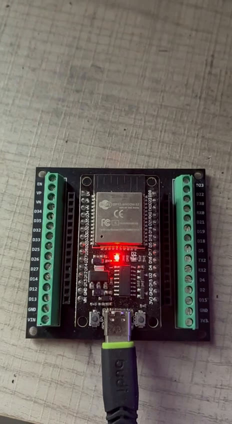

# edgeAI-MachineSense: on-device sound anomaly detection on an ESP32

An autoencoder is trained on healthy machine sound, quantized to int8 TensorFlow
Lite, and run on a real ESP32 with TFLite Micro. The board scores each audio frame
by reconstruction error and raises an anomaly flag on its LED when the score
crosses a threshold.

Dataset: MIMII fan (DCASE 2020 Task 2). Hardware: ESP32 WROOM, ESP-IDF v6.0.1.

**Tech stack:** C++ (ESP-IDF, TensorFlow Lite for Microcontrollers, FreeRTOS) on the ESP32 · Python (TensorFlow/Keras) for training, quantization, and evaluation.


*ESP32 WROOM running the int8 model in replay mode: the on-board LED lights when
the reconstruction error crosses the anomaly threshold.*

## Key results

| Deployed model (`id_02`) | Result |
|---|---:|
| Anomaly detection AUC, int8, 562-clip test set | 0.8578 |
| F1 at the chosen threshold | 0.81 (precision 0.85, recall 0.76) |
| On-device inference latency | 49.2 ms per feature vector |
| Tensor-arena RAM used | 15,756 of 24,576 bytes |
| Firmware binary size | 495,088 bytes |
| Automated tests | 15, run in CI |

The board matches the laptop. On a 60-clip matched sample of 18,540 inferences,
scoring the identical clips on both paths, the ESP32 reached AUC 0.8933 against
the host's 0.8944. Both produced the same confusion matrix: 25 true positives, 8
false positives, 5 false negatives, 22 true negatives. Every clip fell on the same
side of the threshold, with zero checksum or anomaly-flag mismatches.

That 0.8933 comes from a balanced 60-clip subset and is not comparable to the
0.8578 full-set figure. The matched run shows agreement between the two paths, not
a better score.

## How it works

```text
Laptop
  MIMII WAV files
    -> log-mel features
    -> autoencoder trained on normal audio only
    -> int8 TFLite export
    -> C model data + anomaly threshold

ESP32 (replay mode)
  host streams held-out feature vectors over UART
    -> rx task
    -> TFLite Micro inference task
    -> reconstruction error, threshold, anomaly flag
    -> result back over UART, LED on anomaly
```

Replay mode means the board runs the real quantized model on real held-out data
without needing a microphone, so on-device results can be compared directly
against the laptop.

<p align="center">
  <br>
  <em>Anomaly LED lit on the ESP32 WROOM when a replayed clip scores above the threshold.</em>
</p>

## Detailed results

### Model comparison

| Path | AUC |
|---|---:|
| Pooled float | 0.7130 |
| Pooled int8 | 0.6947 |
| Per-ID float, macro | 0.7677 |
| Per-ID int8, macro | 0.7677 |
| Best per-ID int8, `id_06` | 0.9256 |
| Weakest per-ID int8, `id_00` | 0.5620 |

Per-machine-ID models beat the pooled baseline, and int8 quantization did not
meaningfully reduce the macro AUC.

### Inference latency

Measured on the board at boot from 100 timed `Invoke()` calls, printed as
`MACHINESENSE_LATENCY`. It is 49.2 ms per feature vector and varies by only about
52 us, as expected for a fixed-size dense int8 graph. Host replay throughput is
not a proxy for this, because at 115200 baud the 2560-byte request alone takes
about 222 ms and hides the real compute cost.

A 10 s clip is about 309 feature vectors, so roughly 15 s of inference, or about
1.5x slower than real time at the full frame rate. That is fine for replay-mode
evaluation, but a live-microphone build would need frame subsampling or an
ESP32-S3.

The cost is measurably not compiler-related, since `-Og` to `-O2` moved it only
from 49.3 ms to 49.2 ms. The likely reason, reasoned about rather than profiled,
is that this is a dense-only model on a classic ESP32 with no SIMD, and `esp-nn`
mainly accelerates convolution rather than fully-connected layers.

### `id_00`: a documented limitation

One of the four machine IDs stays close to random ranking, and four approaches
failed to fix it:

| Experiment | `id_00` AUC |
|---|---:|
| Dense autoencoder, `FRAMES=5`, baseline | 0.5626 |
| Dense autoencoder, `FRAMES=10` | 0.5931 |
| Conv2D autoencoder | 0.5392 |
| Z-score detector | 0.5453 |

Score diagnostics show that `id_00` normal and abnormal clips have heavily
overlapping reconstruction-error distributions. This is a separability limit of
log-mel reconstruction scoring for that machine, not a deployment bug: the same
pipeline reaches 0.8578 on `id_02` and 0.9256 on `id_06`. It is reported rather
than dropped.

## Repo layout

| Folder | Purpose |
|---|---|
| `ml/` | Training, evaluation, quantization, model export, thresholds |
| `firmware/` | ESP-IDF firmware, TFLite Micro inference, UART replay |
| `docs/` | Architecture notes |

## Quick start

Train and export the per-machine-ID deployment model:

```powershell
cd ml
pip install -r requirements.txt
python train_per_id.py
python export_per_id.py
python compute_threshold.py --machine-id id_02
```

Build, flash, and run against the board:

```powershell
cd firmware
idf.py set-target esp32
idf.py -p COM7 build flash

cd tools
pip install -r requirements.txt
python replay_client.py --port COM7 --machine-id id_02 --limit-files 20
```

With no board attached, the same math runs in Python:

```powershell
python replay_client.py --mock --machine-id id_02
```

Run the tests:

```powershell
.\ml\.venv\Scripts\python.exe -m pytest -q ml firmware/tools/tests
```

See [`ml/README.md`](ml/README.md) and [`firmware/README.md`](firmware/README.md)
for details, and [`docs/architecture.md`](docs/architecture.md) for design notes.

## Limitations

- Hardware validation uses feature vectors replayed over UART. Live microphone
  capture is not implemented.
- `id_00` is not reliably detectable with this method. The deployed `id_02` path
  is unaffected.
- CI runs lint and the dataset-free tests. It does not build the ESP-IDF firmware,
  which needs the full toolchain and the generated model headers.
